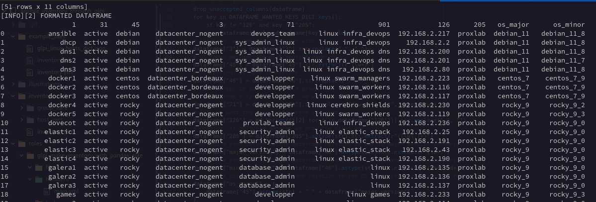

# Technologies

GLPI 10

Ansible

Python 3

# What is it for ?

Dedicated to build an ansible inventory based on GLPI Computers.

Understanding should be pretty simple.

Panda is used to parse the JSON from GLPI's API REST.

Notice that **just a few computer's attributes are used. Those i found relevant.**

Also, **pay attention to the illustrations and example files.**

We are not working a dataset. We just take advantages from Numpy (through Panda).

# How it works ?

At each run a new inventory is made.

Nothing predictive, just a basic tool. All could be done with only either Ansible or Python.

There should be enough formatting examples.

Ansible requests a JSON from the GLPI's API relative to the Computers.

Ansible calls the Python script execution which runs Panda.

Panda parses the JSON. It records in a list all necessary formated items.

Then we browse the list and unstack items sequentially into an "ini" file.

Ansible convert the ini file into yaml.

Based on the Ansible role's vars the inventory.yml is either copied into inventory folder, mailed or uploaded into a git repo.

# Prerequisites

- GLPI (illustrations from a personal lab)

  We create an account dedicated to the process, i call it inventory_maker:
  

  We attribute admin role to inventory_maker account:
  

  We create an API token for the inventory_maker account:
  

  We set a default view dedicated to declare what we wish in the JSON.

  The attribute fields you choose will be the ones obtained in the JSON.

  

  **Pay attention to the datas presentation.**

# What we expect from the Ansible inventory file

To respect the traditional syntax. In order to control it we convert the ".ini" into ".yml".

We want each host with a fqdn and each one with 1 ip address.

We want different groups: based on OS name, OS major version, OS minor version, status glpi's tag, and location.

We want to use group_vars and host_vars. By default you will have several examples (inventory in ini and yaml format, and also group_vars, host_vars).

Ansible group_vars must not contain the "." character.

# About example files

You have several examples:

  - example_files/glpi_linux_hosts_dict.json: an example of what the GLPI's API returns.

  - example_files/inventory_python.ini: an example from the ouput of the make_inventory.py script.

  - example_files/inventory.yml: an example based on the ini one, after ansible's conversion.

  - inventory/inventory.yml: duplicated from the example in which we can set our local workstation ip.

  - inventory/group_vars/* and inventory/host_vars/*

Dummy example of a GLPI computer from my proxmox lab:

    {
        "1": "dhcp",
        "3": "Datacenter Nogent",
        "4": "Desktop",
        "31": "active",
        "45": "Debian GNU/Linux 11 (bullseye)",
        "46": "11.8",
        "71": "devops_team > sys_admin_linux",
        "80": "Root Entity > Linux > Debian",
        "126": [
            "127.0.0.1",
            "::1",
            "192.168.2.2",
            "fe80::b4bf:cbff:feae:cbe5",
            "2a01:e0a:199:a880:b4bf:cbff:feae:cbe5"
        ],
        "205": "proxlab",
        "901": "linux infra_devops"
    }

By default the script outputs the dataframe before and after formatting.

# How to use it ?

- Clone the repo:

  git clone https://github.com/memphis-tools/ansible_inventory_through_glpi.git

  cd ansible_inventory_through_glpi

- Create a venv, source it and install requirements:

  python -m venv venv

  source venv/bin/activate

  pip install -r requirements.txt

- Update the Ansible role's vars:
    - make_inventory_api_url
    - make_inventory_app_token
    - make_inventory_user_token
    - make_inventory_smtp_host (optional)

- Execute:

  ansible-playbook site.yml -i doit,

- Test it (check group_vars and host_vars):

  ansible -i inventory/inventory.yml dns1.proxlab,dhcp.proxlab,debian_11_7 -m ping

- Lint it:

  pip install ansible-lint black pylint

  ansible-lint roles/

  black make_inventory.py

  pylint make_inventory.py

# Links:

Work with ansible inventory: https://docs.ansible.com/ansible/latest/inventory_guide/intro_inventory.html

About Ansible group_vars and host_vars: https://docs.ansible.com/ansible/latest/inventory_guide/intro_inventory.html

About Ansible handlers: https://docs.ansible.com/ansible/latest/playbook_guide/playbooks_handlers.html

Ansible tips tricks: https://docs.ansible.com/ansible/latest/tips_tricks/ansible_tips_tricks.html#tip-for-variables-and-vaults
